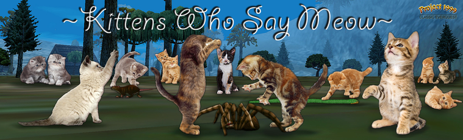

  

  <h1>Team Charter</h1>

A charter for successful community software development. This central repository details the team's processes, project standards, schedules, and structure. It'll serve as the unified reference for our approach to coordinating and executing software projects.

  
[Goals & Objectives »](https://github.com/KWSM-P99/project-governance/blob/main/GOALS.md) 
[Our Projects »](https://github.com/KWSM-P99/project-governance/edit/main/README.md) 
[Roles & Responsibilities »](https://github.com/KWSM-P99/project-governance/edit/main/README.md) 
[Contribution guideline »](https://github.com/KWSM-P99/project-governance/edit/main/README.md) 

##

## Why do we need structure?

The journey from a scattered idea to a successful implementation is riddled with challenges. Just as it's hard to herd cats, guiding a diverse team of passionate individuals towards building coherent and effective software can be even more daunting. A structured approach doesn't just bring order to chaos; it aligns our collective energy, ensuring that every member is rowing in the same direction and amplifying our potential.

## What is the goal of this charter?

At the heart of our endeavors is our community. Our aim is to consistently provide value by creating tools that aren’t just effective but are specially designed to cater to the unique needs and nuances of our community. By embracing the open-source ethos, we not only invite transparency but also encourage every community member to play an active role. Everyone should feel empowered to contribute, provide insights, and shape the tools that we build. Our ultimate objective? To collectively drive our community towards success.

## How we plan to achieve that goal?

Our strategy is rooted in organization and clarity. This repository is more than just a digital space; it's the backbone of our mission. By housing key resources, guidelines, and documents here, we ensure that every team member has access to a clear roadmap. It's not just about maintaining items; it's about fostering an environment where collaboration thrives. Here, every idea finds its footing, every challenge is addressed head-on, and our collective goals are translated into actionable tasks.

| **Deliverable** | **Description** |
|---|---|
| Current Goals and Objectives | Outlined and approved by the steering committee to ensure alignment with the broader vision. |
| List of Current Projects | Regularly updated to provide a snapshot of ongoing efforts and initiatives. |
| New Project Proposal Review | A systematic approach to vetting and incorporating new project ideas, ensuring alignment with our objectives. |
| Change Management for Projects | Processes in place to ensure modifications to existing projects are done thoughtfully and in alignment with our standards. |
| Key Roles & Responsibilities | Defined to bring clarity to individual and group expectations and ensure smooth operations. |
| Contribution Guidelines | Framed to encourage and facilitate seamless contributions from both internal team members and the wider community. |
| Community Onboarding Process | Designed to welcome, educate, and integrate new community members, ensuring they feel valued and informed. |
| Monthly Events Schedule | A pre-defined calendar for team synchronizations, fostering regular communication and collaboration. |
| Event Agenda Records | Maintained to provide transparency, accountability, and historical context for our meetings and decisions. |

Through these deliverables, we aim to bring our goals to fruition, harnessing the collective power of our community for the benefit of all.

##

